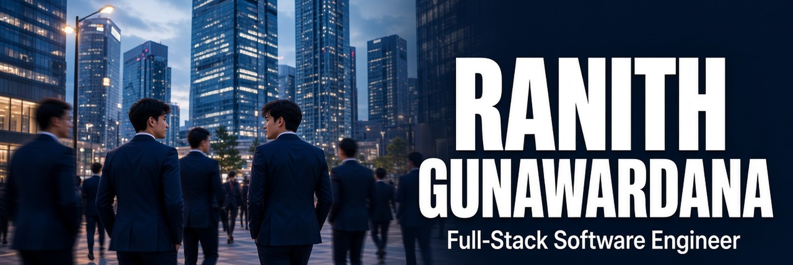

## 🎯 About Me

<table>
<tr>
<td width="58%" valign="top">

```typescript
const ranith = {
    role: "Full-Stack Software Engineer",
    location: "Sri Lanka 🇱🇰",

    building: [
        "Scalable web systems",
        "Full Stack Projects"
    ],

    learning: [
        "System Design",
        "Cloud architecture",
        "ML in production"
    ],

    tech: {
        frontend: ["React", "Next.js", "TypeScript"],
        backend: ["NestJS", "Node.js"],
        cloud: ["AWS", "Azure", "Docker"],
        database: ["PostgreSQL", "MongoDB"]
    }
};
```

<br>


</td>
<td width="42%" align="center" valign="middle">
  
</td>
</tr>
</table>

<br>

## 🌐 Connect With Me

<p align="center">
  <a href="https://linkedin.com/in/ranith2k3"></a>
  <a href="https://twitter.com/_Ranith"></a>
  <a href="https://www.instagram.com/ranith_gunawardana/"></a>
  <a href="https://www.ranith.tech"></a>
  <a href="https://github.com/techie-ranith"></a>
  <a href="mailto:ranithgunawardana@gmail.com"></a>
</p>

<br>

## 💼 Featured Projects

Shipped end-to-end — architecture, APIs, and the product surface. Full case studies on [ranith.tech](https://www.ranith.tech).

<table>
  <tr>
    <td width="50%" valign="top">
      <strong>PainPal</strong><br/>
      Clinical platform for migraine care — Next.js, Python ML microservices, MRI inference, and role-based doctor/admin dashboards.<br/>
      <a href="https://github.com/techie-ranith/PainPal-Web">Web</a> · <a href="https://github.com/techie-ranith/PainPal-MobileApp">Mobile</a> · Next.js · Python · PyTorch
    </td>
    <td width="50%" valign="top">
      <strong>StayOS</strong><br/>
      Multi-tenant hotel PMS — reservations, housekeeping, invoicing, and per-property branding on Next.js, Prisma, and MongoDB.<br/>
      <a href="https://github.com/techie-ranith/StaySync">StaySync</a> · Next.js · Prisma · MongoDB
    </td>
  </tr>
  <tr>
    <td width="50%" valign="top">
      <strong>APEX Wear</strong><br/>
      Full-stack fitness e-commerce — 30+ screens, Stripe checkout, inventory-safe orders, and a NestJS API on MongoDB.<br/>
      <a href="https://www.ranith.tech">Case study</a> · React · NestJS · Stripe
    </td>
    <td width="50%" valign="top">
      <strong>Autostream.lk</strong><br/>
      Sri Lanka vehicle marketplace — NestJS microservices, valuations, BLUE-T grading, and role portals on Azure.<br/>
      <a href="https://www.ranith.tech">Case study</a> · NestJS · React · Azure
    </td>
  </tr>
  <tr>
    <td width="50%" valign="top">
      <strong>Toyota Intranet & OdysseyX</strong><br/>
      Enterprise intranet and MBO/BSC performance system for Toyota Lanka — JWT roles, TypeORM, AWS, Cloudflare R2.<br/>
      <a href="https://www.ranith.tech">Case study</a> · NestJS · React · MySQL
    </td>
    <td width="50%" valign="top">
      <strong>SkillMatch</strong><br/>
      AI talent platform — Next.js, Docker microservices, Hugging Face recommendations. Standout exhibit at NSBM Open Day 2025.<br/>
      <a href="https://github.com/techie-ranith/Skillmatch">GitHub</a> · Next.js · Docker · Flask
    </td>
  </tr>
</table>

<div align="center">
  <a href="https://github.com/techie-ranith/PainPal-Web">
    
  </a>
  <a href="https://github.com/techie-ranith/Skillmatch">
    
  </a>
</div>

<br>

## 🛠️ Tech Stack

<p align="center">
  
</p>

<p align="center">
  
  
  
  
  
  
  
  
  
  
  
  
  
  
  
</p>

<br>

## 📊 GitHub Analytics

<p align="center">
  
</p>

<p align="center">
  
  
</p>

<p align="center">
  
  
</p>

## 🏆 GitHub Trophies

<p align="center">
  <a href="https://github.com/techie-ranith">
    
  </a>
</p>
